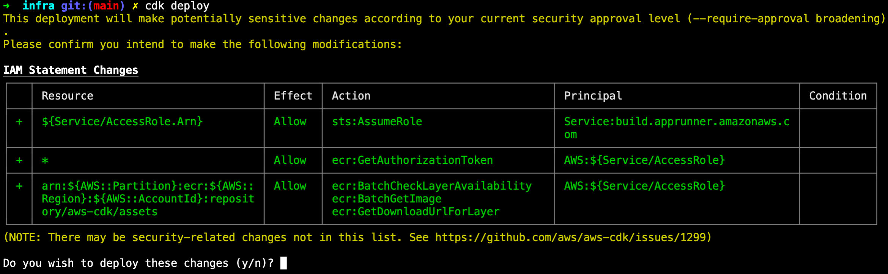
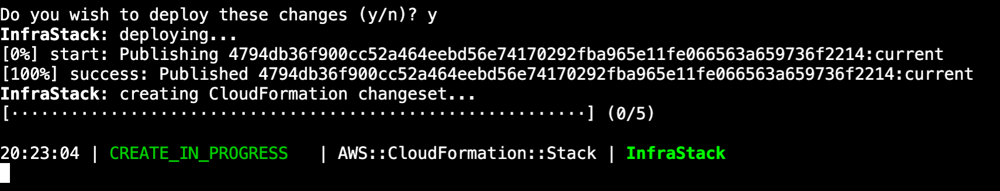
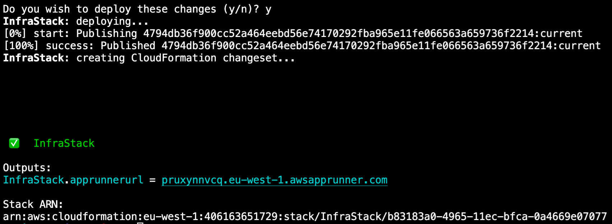

# minimal-dash-app
[A minimal Dash app](https://dash.plotly.com/minimal-app) used for App Runner demo.

### Run in local 

```shell
##Installing virtualenv
python3 -m pip install --user virtualenv
##Creating a virtual environment
python3 -m venv env
##Activating a virtual environment
source env/bin/activate
##Install packages
pip install -r requirements.txt
```

#### Leaving the virtual environment
```shell
deactivate
```

### `apprunner.yaml`
Configuration file for App Runner. For an overview of App Runner configuration files, see [Setting App Runner service options using a configuration file](https://docs.aws.amazon.com/apprunner/latest/dg/config-file.html).

You can also configure your App Runner service(app) from App Runner console instead of this configuration file.

### HTTP Health Check
Add a Health Check Endpoint to use HTTP Health Check with App Runner.

```python
@app.server.route("/health")
def healthcheck():
  app.logger.info("Healthy")
  return "{status: ok}"
```

### Deployment on AWS APP Runner
AWS App Runner is an AWS service that provides a fast, simple, and cost-effective way to turn an existing container image or source code directly into a running web service in the AWS Cloud. [This tutorial covers how you can use AWS App Runner to deploy your application to an App Runner service](https://docs.aws.amazon.com/apprunner/latest/dg/getting-started.html)


### Deployment with CDK
Next, ensure you have CDK v2 installed. If you do not have it installed, please follow the steps in the Get Started with [AWS CDK guide](https://aws.amazon.com/fr/getting-started/guides/setup-cdk/).

```shell
cdk --version
cd infra
npm i @aws-cdk/aws-apprunner-alpha
cdk bootstrap
cdk deploy
```

You should see an output similar to the following:



CDK will prompt you before creating the infrastructure because it will create infrastructure that changes security configuration—in this case, by creating IAM roles and security groups. Press y and then Enter to deploy. CDK will now set up all the infrastructure you defined. It will take a few minutes to complete. While it is running, you will see updates like this:



Once it completes, you will see an output with the link to the public URL to access your service, as shown in the following:



### Delete the cloud-based infrastructure with cdk

AWS CDK makes it easy to delete your infrastructure with just one command. To remove all the infrastructure you created, use the cdk destroy command—this will only remove infrastructure created during this tutorial. 

You will see a confirmation: 

```shell
cdk destroy 

Are you sure you want to delete: InfraStack (y/n)? 
```

After you press y and Enter, CDK will start removing all the infrastructure and provide updates. Once completed, you will see the following:

Are you sure you want to delete: InfraStack (y/n)? y
InfraStack: destroying...

✅  InfraStack: destroyed